# IS64-logging
Scripts for viewing the IS64 logs using [Project64](https://www.pj64-emu.com/).

[Project64 script for IS64 made by LuigiBlood and Kenix.](https://github.com/LuigiBlood/EmuScripts/blob/master/N64/Project64/IS64Log_DebugServer.js)

This was released into the public domain with permission from LuigiBlood and Kenix.

[Instructions on how to setup/use](#instructions)

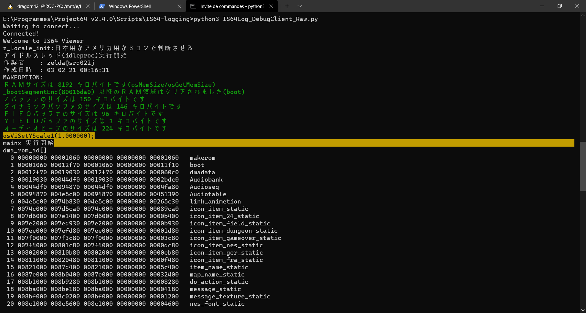

I modified the original script because the `euc-jp` encoding that OoT64 uses was giving me trouble. I moved decoding data from the Project64 server script to a Python client script.

Consider changing `euc-jp` to whatever you need for other games in [IS64Log_DebugClient_Raw.py](IS64Log_DebugClient_Raw.py).

# Instructions

These screenshots were made with a fresh [Project64 3.0.1](https://www.pj64-emu.com/download/project64-3-0-1-installer) install, but this has worked for many previous Project64 versions. Parts of the menu may be a bit different depending on your version.

## Enable Project64 Debugger

Open Project64 settings.

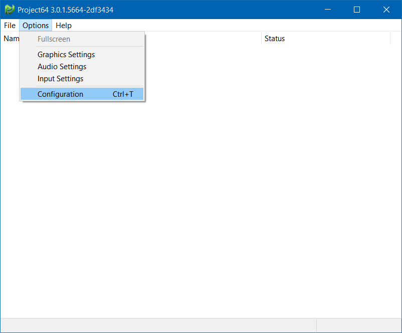

Disable `Hide advanced settings`.

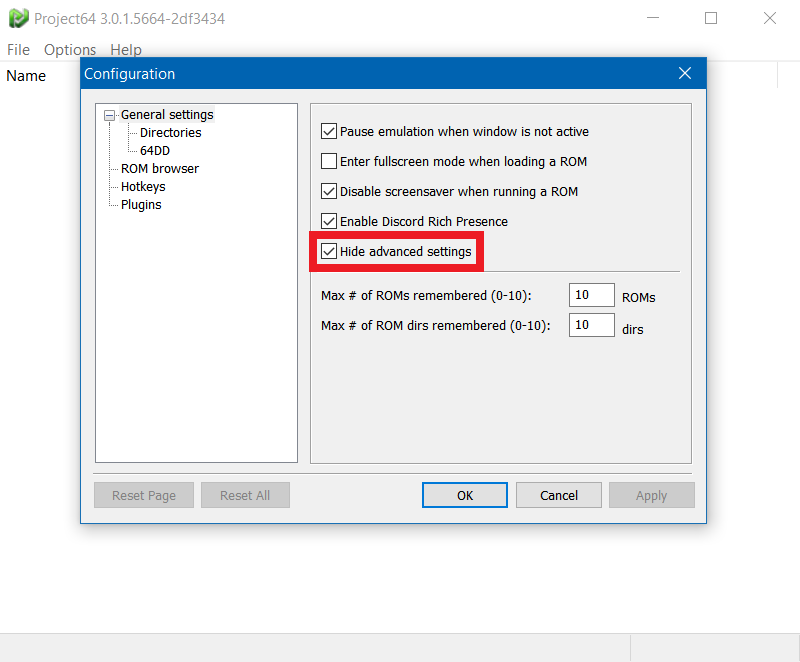

Open the `Advanced` settings tab.

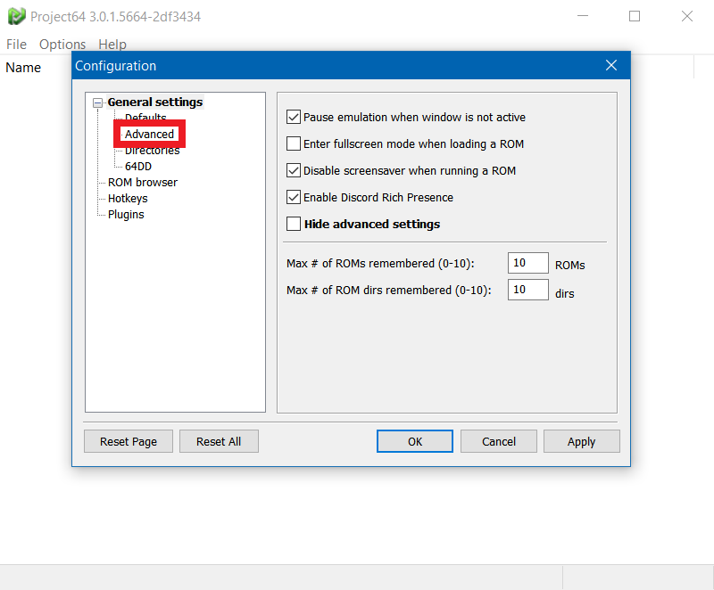

Enable `Enable debugger`.

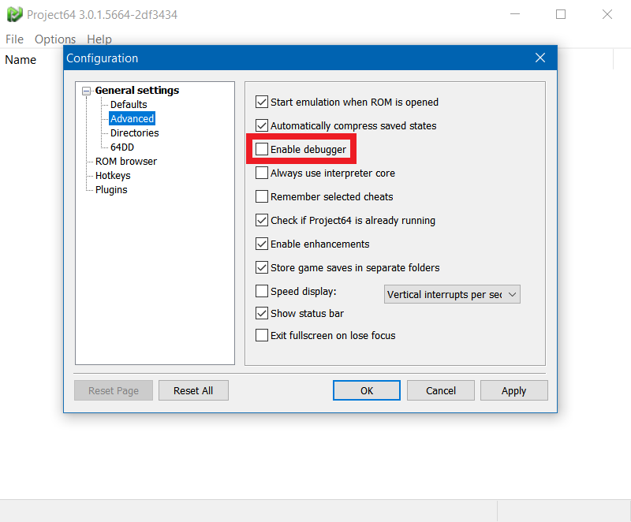

Click `OK`.

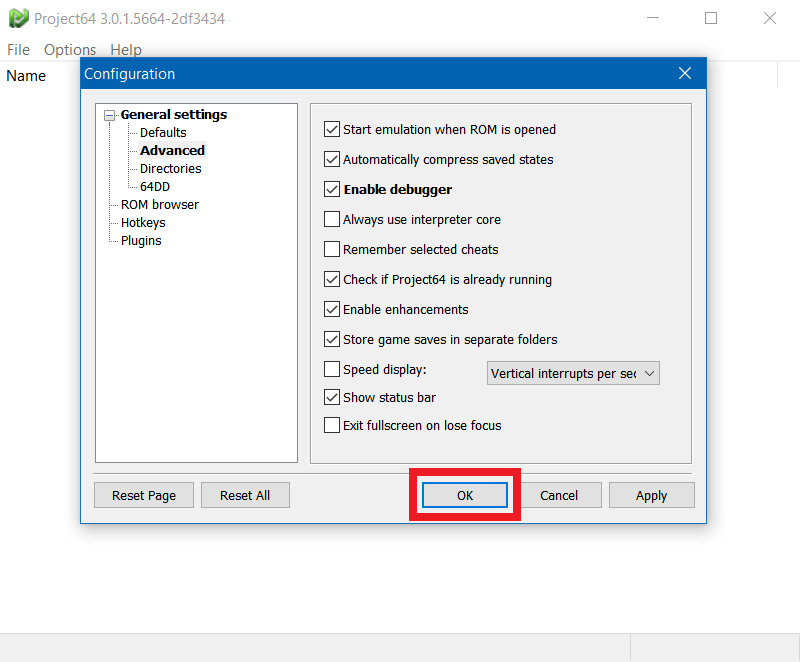

## Add Project64 script

Open Project64's scripts window.

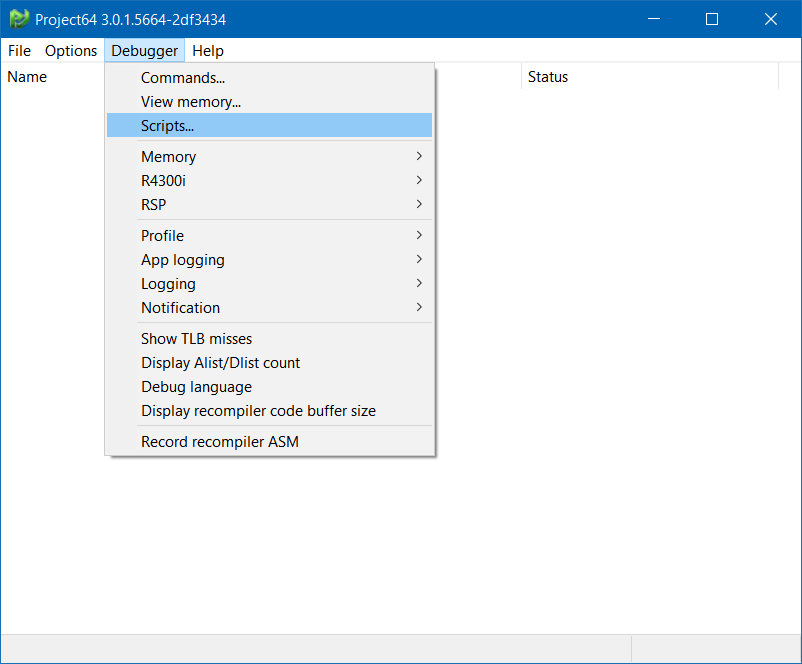

Open Project64's `Scripts` folder (only works if you created the folder before).

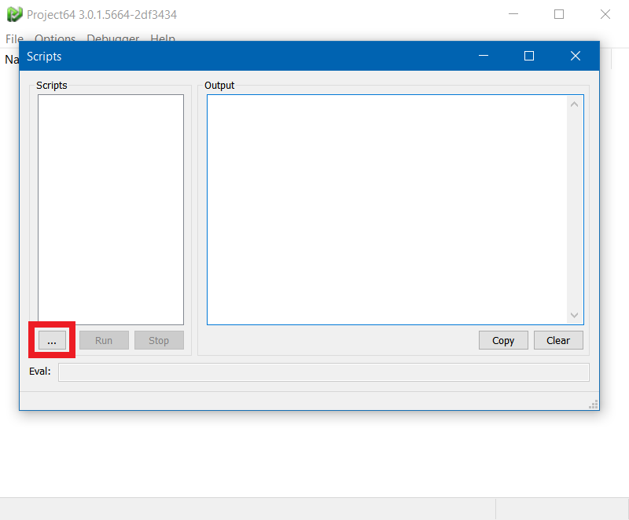

If you didn't create the `Scripts` folder, navigate to Project64's installation folder and create it.

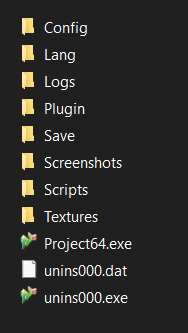

Add [IS64Log_DebugServer_Raw.js](IS64Log_DebugServer_Raw.js) in the Scripts folder.
Close and reopen Project64's scripts window.

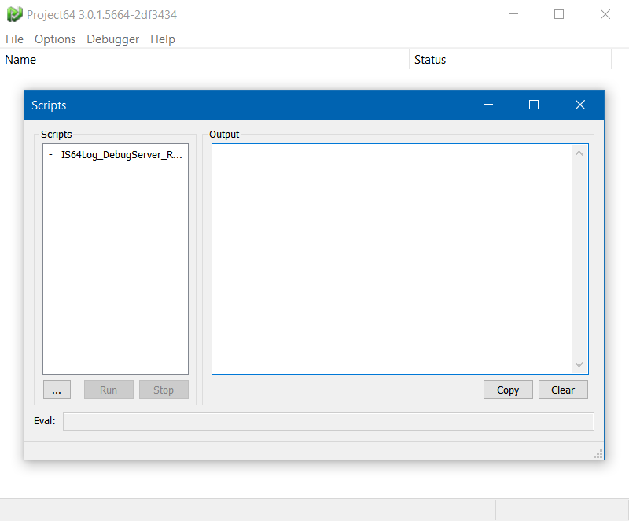

## Run Project64 script

Right click the script name and choose `Run`, or double click the script name.
When running the script the first time, you may get a security alert from the Windows firewall, allow Project64.

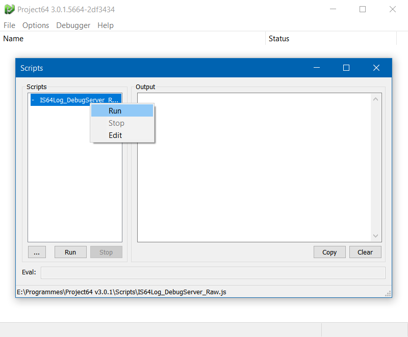
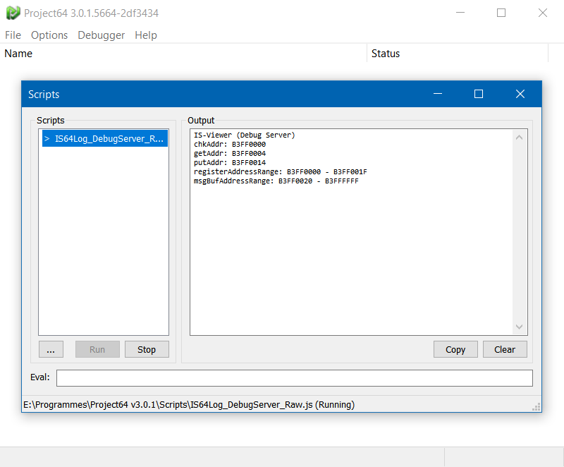

## Run client script

You need [python3](https://www.python.org/downloads/).

If you have Blender installed, you can probably use its python executable (for example `C:\Program Files\Blender Foundation\Blender 2.93\2.93\python\bin\python.exe`). Or any other program that uses python3.

Run [IS64Log_DebugClient_Raw.py](IS64Log_DebugClient_Raw.py), by drag&dropping onto the `python` executable, or associate the `.py` extension.

If you want to run [IS64Log_DebugClient_Raw.py](IS64Log_DebugClient_Raw.py) in [WSL](https://docs.microsoft.com/en-us/windows/wsl/), you need to change the ip address in the script from `127.0.0.1` to your [local ip address](https://www.ipconfig.in/what-is-my-local-ip-address/) (for example `192.168.1.20`).

The only way I know of to have proper display of japanese characters is to use [Windows Terminal](https://docs.microsoft.com/en-us/windows/terminal/) with: the basic command interpreter, Powershell, or a WSL shell.

## Use interpreter

This setting must be set again for every ROM, and may need to be set again after modifying the ROM. If the scripts do nothing, first check that the ROM is configured to use interpreter.

**Open the ROM you want to use the scripts with.**

Open Project64 settings and show ROM settings tabs.

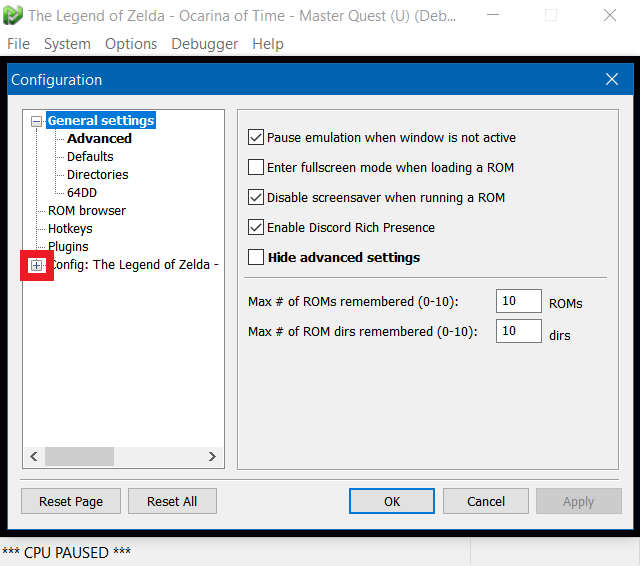

Open the `Recompiler` ROM settings tab.

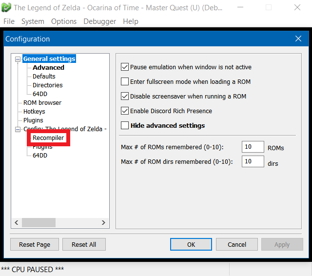

Click the drop-down next to `CPU core style` and pick `Interpreter`.

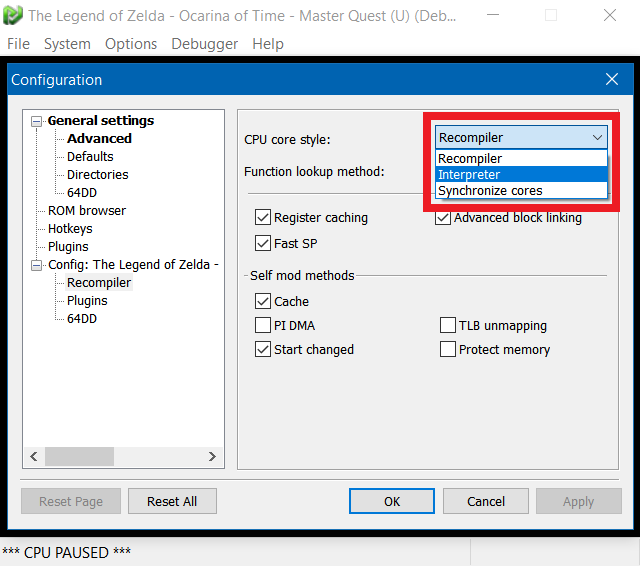
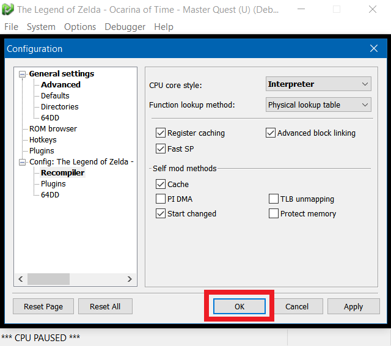

Stop the emulation.

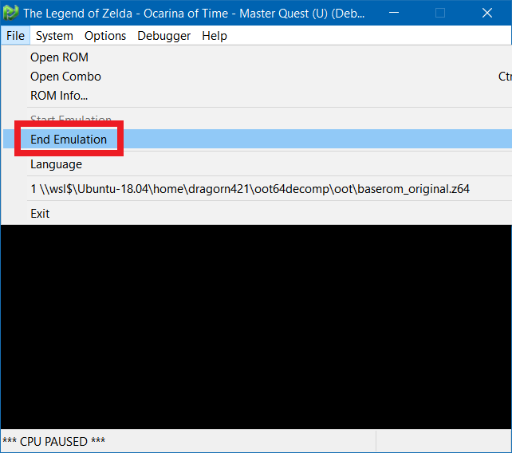

Open the ROM again. You should now be able to see game logs in the console where `IS64Log_DebugClient_Raw.py` is running.

For example, running `IS64Log_DebugClient_Raw.py` in the basic command interpreter in Windows Terminal:

